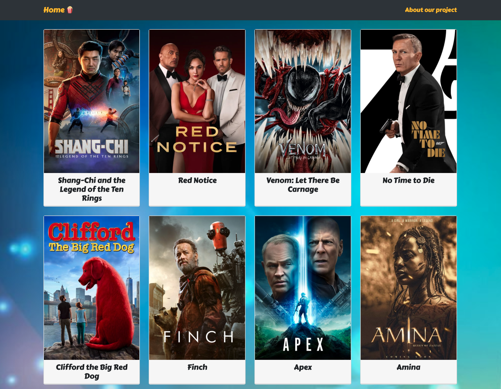

# Project 2 - Random Movie Generator
##Overview
The second project of the Software Engineering Immersive was a hackathon style pair programming project. I was paired with @miskhill.

The project has been deployed using Netlify, view the app <a href="https://movieproject2.netlify.app/" target="_blank">here</a>

## Brief

- To create a React application that consumes a public API.
- Must include several components.
- Have a router with several pages.

**Timeframe: 48 hours**

## Technologies used

 - React
 - JavaScript ES6
 - HTML 5
 - SASS
 - Bootstrap
 - Git

## Process
### Planning
Early on in the planning stage we agreed that we wanted to use a Movie API as this was something we both had an interest in. Differentiating this from other websites would be part of the challenge, therefore we thought that we would market this as a Random Movie Generator, for those days when you don't know what you want to watch.
We drew up some ideas using pen and paper as we wanted to come up with a few different wireframes for how we would want the website to look.

Whilst we went through most of the coding section together I had a greater influence on the style of the page, using colorhunt.co to find a suitable color palette for the app, as well as Bootstrap as a quicker way to accurately place “movie cards” on the index page.

### Coding

This was our first project using components and routers. I felt that learning how to use React helped me clarify my understanding of the functions being used as it was easier to see a direct correlation between the functions used and JSON schema. The use of a BrowserRouter allowed us to separate the functions into components, therefore increasing its readability as well as making things easier for us when coding and piecing things together.

### Movie Page

The function we used to generate a random movie. As we were unsure of how many movie ID’s there were/ how many ID’s were not being used we edited our function to choose between 1 and 1000 to make use of a smaller sample size.
By understanding the API we were using we were able the construct the axios get request to select a URL with a random number, therefore completing the “randomiser” function

### Top Rated Movies

Following the API documentation, we were able to create a page that displayed the top rated movies whilst displaying the information we wanted. This time, the axios get request would be calling a different URL. We were then able to display the movies that had been called into a Top Rated Movies page.

### Results
Considering this was the first app I have been a part of using React I was relatively pleased with the result. I felt that understanding how to dig down and retrieve information took significantly more time than ideal, therefore restricting some of the potential functionality of the site.

## Wins/Challenges
### Wins
- Creating our first fully functioning application, in hindsight was quite simple but worked effectively.
-  Using Bootstrap was extremely helpful and intuitive, saving a lot of time when it came to styling.
- Being able to use the API and extract the desired information.

### Challenges
- Reading and understanding API documentation and how to use it to correctly access and display information. A lot of time was spent working out how to extract information as often the data we were requesting were nested in arrays.
- Managing time effectively - as this was a 48 hour project it felt very overwhelming at certain points, especially when we hit roadblocks in our code.

## Future Improvements
- The API includes empty ID's that may have been deleted by either API or a user. In these cases our application would show a blank page. To fix this I would write a function that would force a page rerender in the case that there was no information.
- Whilst our application was focused on displaying random movies this would probably have been better suited as a component, with the application being able to display movies by genre or having search functionality.

## Key Learnings
- Using API documentation and learning how to de-structure data properly.
- For future projects using a dedicated wireframe site would more than likely end up being more efficient and cleaner.

